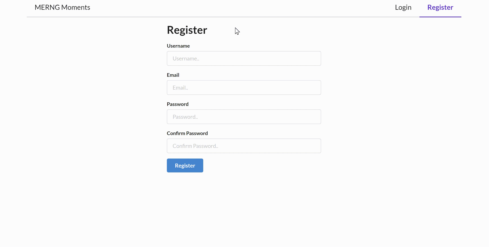
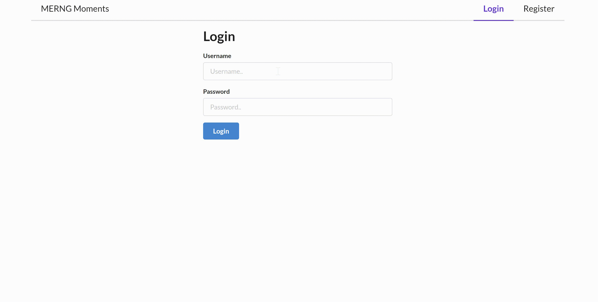
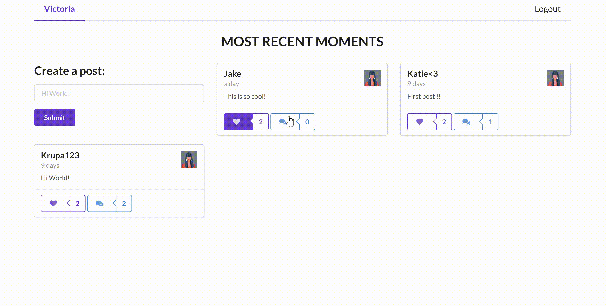
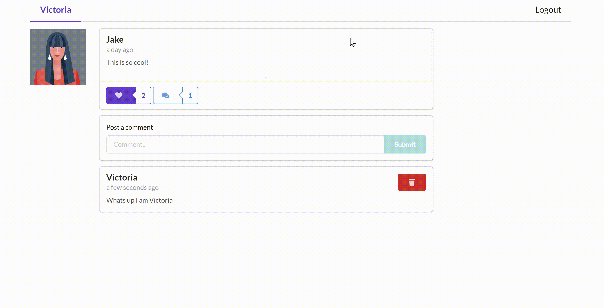
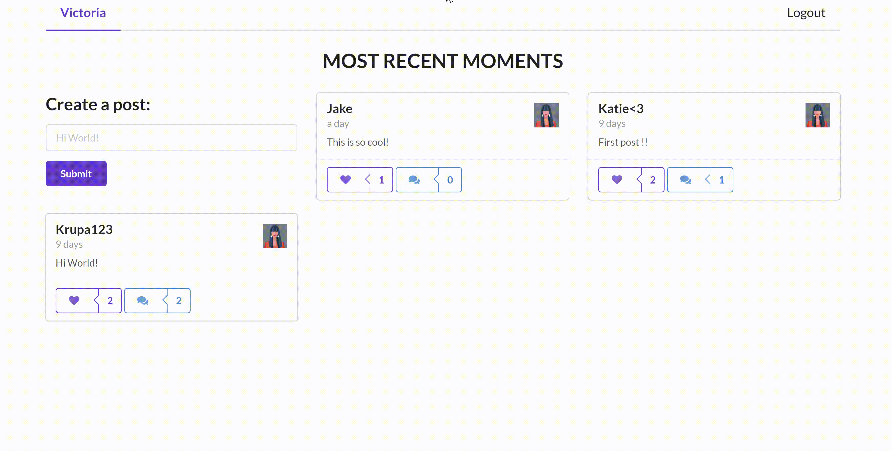

# MERNG-Moments - Social Media App

A full stack project for a small social media app, using MERNG stack (MongoDB, Express, React JS, Node and GraphQL)

### Note
This repository is still under development and I will continue to add more features to it.

### Project features

- Register user

 

- Login user

 

- Comment on a post

 

* Delete owned comments

 

* Like and unlike posts

 

* View all posts
* View a single post
* Create a post
* Delete owned posts

### Technolgies used

* Node JS
* Express
* Apollo Server
* GraphQL
* Mongoose
* Mongo DB
* React JS
* Apollo Client
